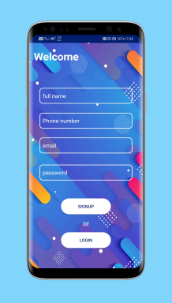
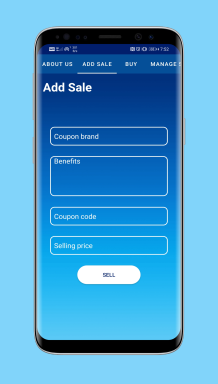
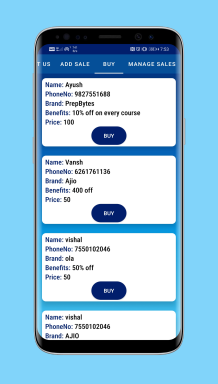
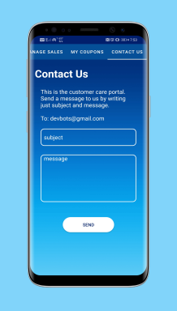

# Coupon Bazar  by DevBots
### **Problem statement :**

 *Coupons can be really helpful while buying online products but people don't have time to find it and it's difficult too.*

### **Abstract :**

*So analyzing the problem stated in the previous slide, our team came up with a solution, Coupons can be very helpful economically but people don't give much attention to it because sometimes coupons of a particular brand gets difficult to find. So we built a coupon trading android application and a web application  from which people can buy and sell coupons and vouchers according to their needs.*

### **The User Experience :**

* **Splash Screen**

* **Signup & Login**

* **About us Tab**

* **Add sale Tab**

* **Buy Tab**

* **Manage sale Tab**

* **My Coupons Tab**

* **Contact us Tab**

